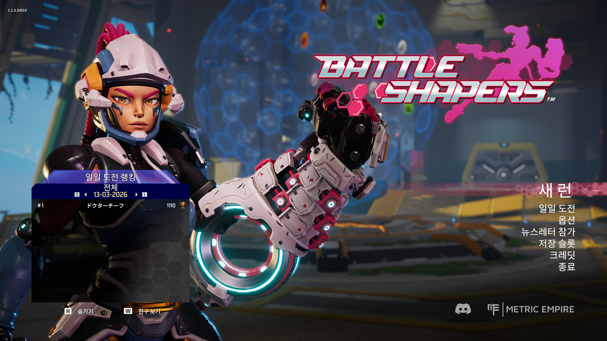
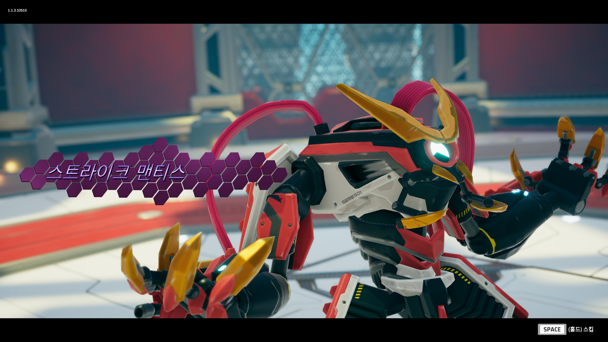
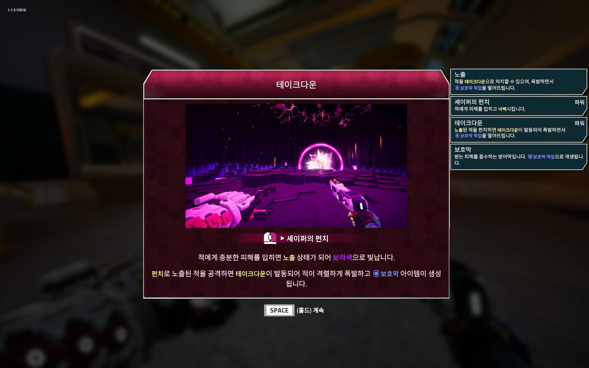
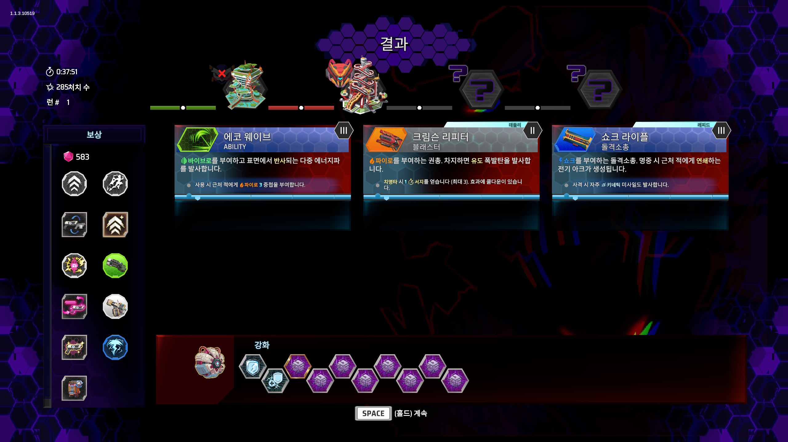
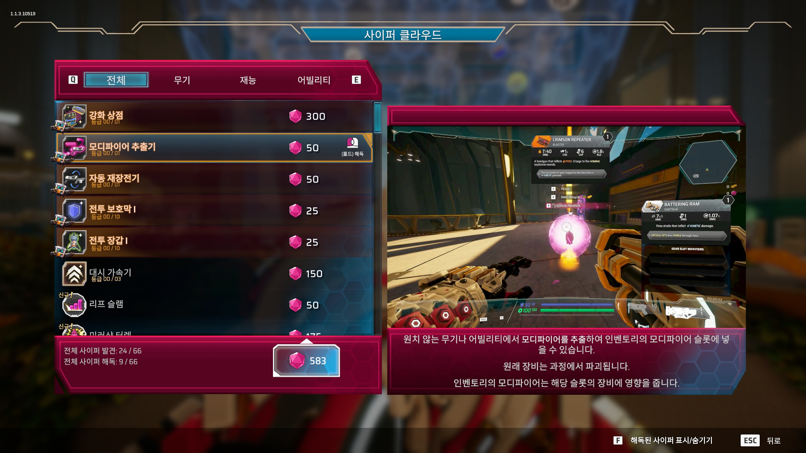
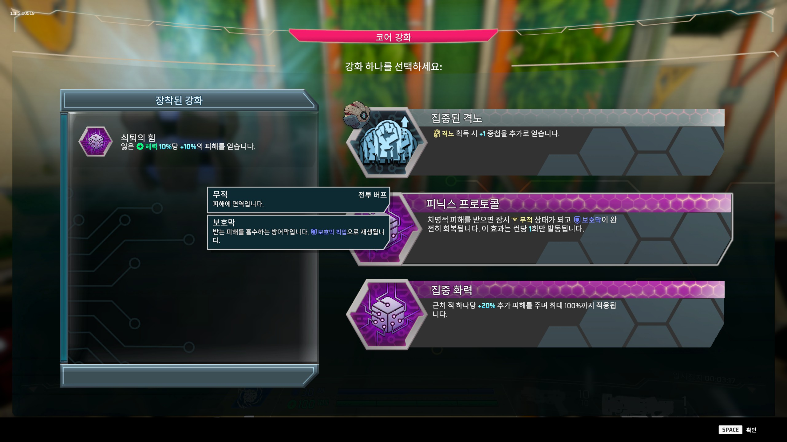

# Battle Shapers 한글패치 v2.0.0

> 공식 한국어 지원이 없는 Battle Shapers의 비공식 한글패치입니다.

---

## 📸 스크린샷

| | |
|---|---|
|  |  |
|  |  |
|  |  |

---

## 📋 번역 범위

| 분류 | 항목 수 | 상태 |
|------|--------|------|
| 대사 (Dialogue) | 7,058 | ✅ 완료 |
| UI / 메뉴 (LocSheet) | 3,968 | ✅ 완료 |
| **합계** | **11,026개** | ✅ |

### 주요 용어

| 영문 | 한국어 | 비고 |
|------|--------|------|
| VerOS | 베로스 | 메인 빌런 (AI 오버로드) |
| JanOS | 야노스 | 이전 AI 운영체제 |
| Fortify | 방호 | 피해감소 버프 |
| Fury | 격노 | 피해증가 버프 |
| Reflect | 반사 | 투사체 반사 |
| Outburst | 아웃버스트 | 코어 어빌리티 |
| Meemo | 미모 | 아군 로봇 동료 |
| New Run | 새 시작 | 메인 메뉴 |

---

## 💾 설치 방법

### 필요 조건
- PC (Windows) Steam 버전

### 설치 순서

**1단계 - 다운로드**
아래 Releases에서 최신 ZIP 파일 다운로드

**2단계 - 압축 해제**
게임 설치 폴더에 **덮어쓰기**로 압축 해제
```
기본 경로: C:\Program Files (x86)\Steam\steamapps\common\BattleShapers
```

**3단계 - 게임 실행**
게임을 실행하면 자동으로 한국어가 표시됩니다.
> v2.0부터 언어 설정과 무관하게 한국어가 표시됩니다. 별도의 언어 변경이 필요 없습니다.

### 파일 구조
```
BattleShapers/
  winhttp.dll                              ← BepInEx 로더
  doorstop_config.ini                      ← BepInEx 설정
  BepInEx/
    config/
      BepInEx.cfg                          ← HideManagerGameObject 설정
    core/                                  ← BepInEx 5 코어
    plugins/
      Hanpaemo.BattleShapers.KoreanPatch.dll   ← 한글패치 플러그인 v2.0.0
      NotoSansKR-Regular.otf                    ← 한국어 폰트 (잘난체 고딕)
    Translation/
      ko/BattleShapers/
        localization-ko.txt                ← 한국어 번역 데이터 (7,058키)
```

---

## ❓ 자주 묻는 질문

**Q. 게임이 로딩 화면에서 멈춰요**

A. ZIP 파일을 다시 압축 해제해주세요. `BepInEx/config/BepInEx.cfg` 파일이 누락되면 이 문제가 발생할 수 있습니다.

**Q. 한글이 □□로 표시돼요**

A. `BepInEx/plugins/` 폴더에 폰트 파일(.otf)이 있는지 확인해주세요. 패치 ZIP을 다시 압축 해제하면 해결됩니다.

**Q. 게임 업데이트 후에도 번역이 유지되나요?**

A. v2.0부터 게임 파일을 직접 수정하지 않으므로, 게임 업데이트 후에도 패치가 유지됩니다. Steam 무결성 검사와도 충돌하지 않습니다.

**Q. 다른 언어로 플레이하고 싶어요**

A. 패치가 설치된 상태에서는 모든 언어 설정에서 한국어가 표시됩니다. 원래 언어로 돌아가려면 `BepInEx` 폴더와 `winhttp.dll`, `doorstop_config.ini`를 삭제하세요.

---

## 🔧 기술 정보

- **번역 방식**: BepInEx Harmony 패치로 `LocalizationManager.GetLocalizedText`를 런타임에 가로채 한국어 반환 (게임 파일 무수정)
- **폰트**: 잘난체 고딕 (BepInEx 플러그인이 TMP 폴백 폰트로 런타임 주입)
- **프레임워크**: BepInEx 5.4.23.2 + Harmony
- **번역 파일**: `BepInEx/Translation/ko/BattleShapers/localization-ko.txt`

---

## 📝 변경 이력

### v2.0.0 (2026-03-28)
- 런타임 텍스트 가로채기 방식으로 전환 (resources.assets 수정 불필요)
- 게임 업데이트/무결성 검사와 충돌 없음
- BepInEx 올인원 패키지로 변경 (별도 BepInEx 설치 불필요)
- 폰트 변경: Noto Sans KR → 잘난체 고딕
- "새 런" → "새 시작" 용어 수정
- 번역 항목 수 증가: 7,076 → 11,026개

### v1.0 (2026-03-13)
- 최초 배포
- resources.assets 내 zht 슬롯 대체 방식

---

## 📝 오류 제보 / 기여

번역 오류나 누락된 텍스트는 아래로 알려주세요:
- **Issues**: [GitHub Issues](https://github.com/hanpaemo/battle-shapers-korean-patch/issues)
- **블로그**: https://hanpaemo.blogspot.com

---

## ❤️ 후원

번역이 도움이 되셨다면 응원 부탁드립니다!
- **Ko-fi**: https://ko-fi.com/hanpaemo

---

## 👤 제작

**한패모** — 인디게임 한글패치 모음
- GitHub: https://github.com/hanpaemo
- 블로그: https://hanpaemo.blogspot.com

---

## ⚖️ 라이선스

이 패치는 팬 제작 비공식 번역입니다.
게임 원작의 저작권은 **Metric Empire**에 있습니다.
상업적 이용을 금지합니다.
